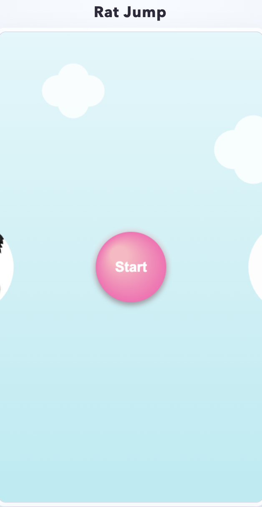
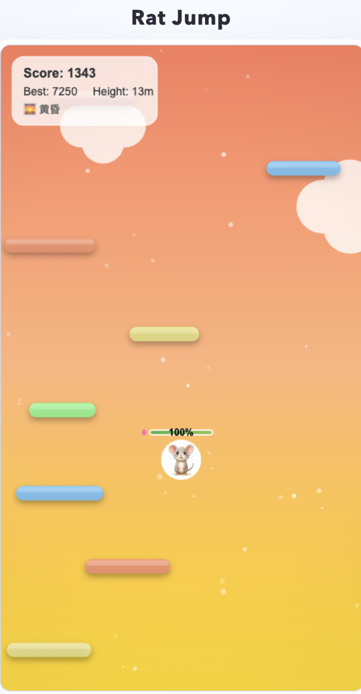

# Rat Jump - Doodle Jump Style Game

A fun endless vertical platformer game where a cute mouse jumps as high as possible while avoiding obstacles. Experience beautiful sky transitions from dawn to starry night as you climb higher!

## Screenshots

<!-- Add your screenshots below - create a screenshots folder and add your images -->

### Start Screen

*The welcoming start screen with cute characters*

### Gameplay - Sunset Mode

*Beautiful golden sunset as you climb higher*


## Game Features

- **Dynamic Sky System**
  - 🌅 Dawn - Warm orange and pink gradients
  - 🌄 Morning - Fresh blue tones
  - ☀️ Day - Bright sky blue
  - 🌆 Dusk - Golden sunset colors
  - 🌇 Sunset - Red-orange evening glow
  - 🌙 Evening - Purple-blue twilight
  - 🌃 Night - Deep blue sky
  - ✨ Starry Night - Twinkling stars

- **Gameplay Mechanics**
  - Endless vertical jumping (Doodle Jump style)
  - Auto-bounce on platforms - no jump button needed!
  - Three platform types:
    - Normal platforms (88%)
    - Moving platforms (8%) - horizontal movement
    - Disappearing platforms (4%) - fade after landing
  - Screen wraps: go off left side to appear on right
  - Fall off bottom = Game Over

- **Visual Effects**
  - Smooth gradient backgrounds that change with height
  - Atmospheric particles floating in the background
  - Cloud decorations (day modes)
  - Twinkling stars (night mode)
  - Score popups and notifications
  - Health bar with color changes

- **Responsive Design**
  - Portrait orientation (9:16 aspect ratio)
  - Mobile-optimized touch controls
  - Desktop keyboard support
  - Auto-rotate reminder for landscape mode

## Controls

### Desktop
- `←` Arrow Left - Move left
- `→` Arrow Right - Move right

### Mobile
- Tap left side of screen - Move left
- Tap right side of screen - Move right
- Visual feedback shows active controls

## How to Play

1. Click the "Start" button to begin
2. The mouse auto-bounces when landing on platforms
3. Use left/right controls to position yourself
4. Aim for the center of platforms for consistent bounces
5. Avoid moving platforms when possible (harder to land on)
6. Be careful with disappearing platforms (orange) - they vanish after one bounce!
7. Climb as high as you can to reach different sky themes
8. Don't fall off the bottom of the screen!

## Scoring

- **Height Bonus**: +100 points for each meter reached
- **Time Score**: +5 points per second survived
- **Health Bonus**: +2 points per remaining HP on game over
- High scores are saved locally

## Sky Theme Heights

- 0m - 300m: Dawn (黎明)
- 300m - 600m: Morning (清晨)
- 600m - 1200m: Day (白天)
- 1200m - 1800m: Dusk (黄昏)
- 1800m - 2400m: Sunset (日落)
- 2400m - 3000m: Evening (傍晚)
- 3000m - 4000m: Night (夜晚)
- 4000+: Starry Night (星空)

## Tips

- The game gets harder as you climb higher
- Moving platforms become more frequent at higher altitudes
- Disappearing platforms increase in frequency
- Try to stay centered on screen for better platform visibility
- Use the screen wrap to your advantage on narrow platforms
- Falling off the bottom is the only way to lose - plan your jumps carefully!

## Technical Details

- Built with vanilla JavaScript (no external dependencies)
- HTML5 Canvas for smooth 60 FPS rendering
- Web Audio API for synthesized sound effects
- Responsive portrait layout optimized for mobile
- Dynamic difficulty scaling based on height
- Efficient platform pooling for performance

## Installation

1. Clone the repository
2. Ensure all files are in the correct structure:
   ```
   ori-vs-rat-game/
   ├── index.html
   ├── game.js
   ├── images/
   │   ├── ori.jpeg
   │   ├── rat.jpeg
   │   └── rat poison.png
   ├── screenshots/        <- Add your game screenshots here
   │   ├── start_screen.png
   │   ├── gameplay_day.png
   │   ├── gameplay_sunset.png
   │   └── gameplay_night.png
   └── README.md
   ```
3. Open index.html in a web browser or use a local server:
   ```bash
   python3 -m http.server 8000
   ```
4. Visit `http://localhost:8000` in your browser

## How to Add Screenshots

1. Play the game and capture screenshots at different heights
2. Create a `screenshots` folder in the project directory
3. Save your screenshots with descriptive names:
   - `start_screen.png` - The start menu
   - `gameplay_day.png` - Gameplay during daytime
   - `gameplay_sunset.png` - Gameplay during sunset
   - `gameplay_night.png` - Gameplay at night with stars
4. Place them in the `screenshots/` folder
5. The README will automatically display them!

**Screenshot Tips:**
- Capture the start screen with both characters
- Play to ~800m for day mode screenshots
- Play to ~1500m for beautiful sunset colors
- Play to ~3500m+ for the starry night effect
- Use browser DevTools or your OS screenshot tool

## Credits

- Game Design & Development: Inspired by Doodle Jump
- Character Images: Original artwork
- Sound Effects: Synthesized using Web Audio API

## License

This project is licensed under the MIT License - see the LICENSE file for details.

## Future Enhancements

- [ ] Power-ups (spring boost, shield, jetpack)
- [ ] More platform types (breakable, bouncy)
- [ ] Boss encounters at certain heights
- [ ] Online leaderboards
- [ ] More character skins
- [ ] Weather effects (rain, snow at higher altitudes)
